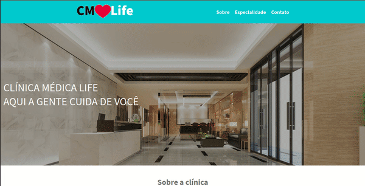

> Status: Concluded ✔️

### Página web desenvolvida como projeto do site de cursos DevMedia, pode conferir meu perfil no link a seguir <a>https://www.devmedia.com.br/perfil/hiordan</a>.

## Technologies used:
<table>
  <tr>
    <th>Technology</th>
    <th>Version</th>
  </tr>
  <tr>
    <td>HTML</td>
    <td>5</td>
  </tr>
  <tr>
    <td>CSS</td>
    <td>3</td>
  </tr>
</table>

### How to run application
 1. Download the files for your machine;
 2. Extract the files;
 3. Double click on the "index.html" file and it will be click on your default browser.

## Web page demo

 

Link to web page <a>https://page-clinica-medica.vercel.app/</a>

  

